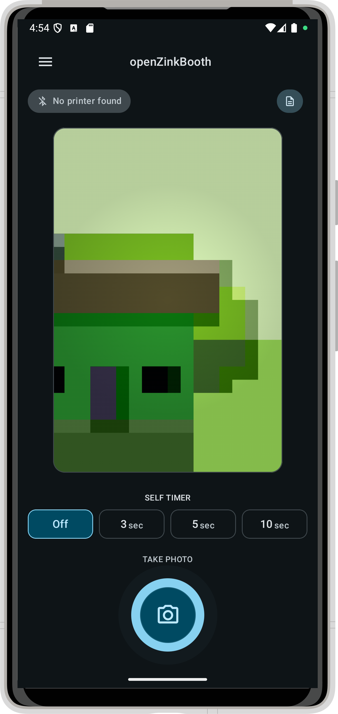
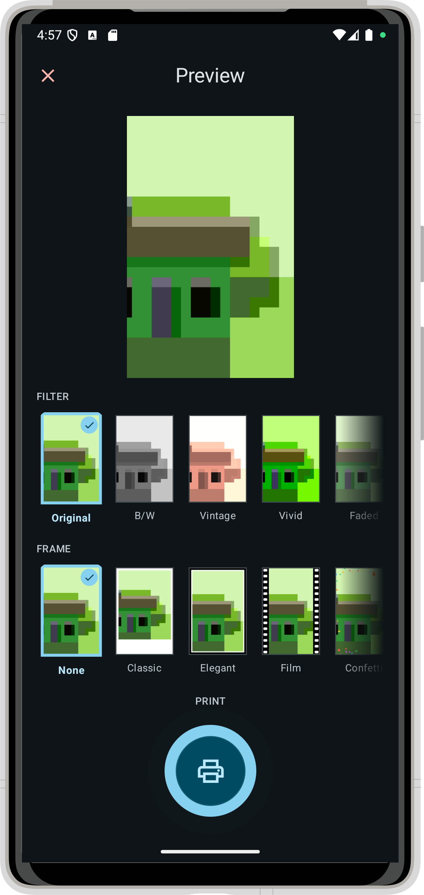
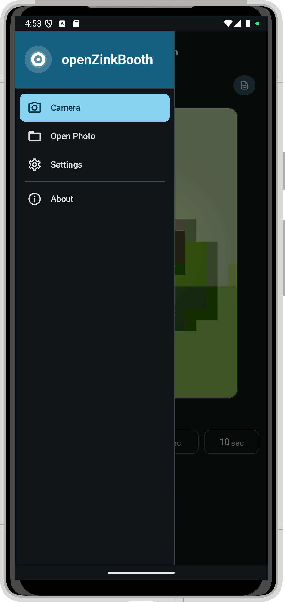
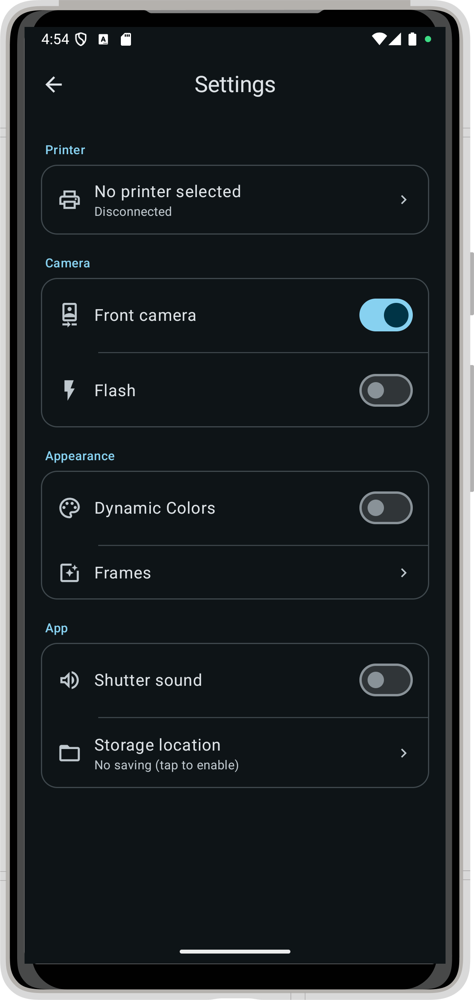

#  openZinkBooth

# Bản Mod lại chỉ sử dụng BLE cho máy HP Sprocket 200 bị lỗi Classic Bluetooth

> [!NOTE]
> For the latest development state, install the latest [openZinkBooth dev](https://github.com/oliexdev/openZinkBooth/releases/tag/dev-build) build from the [GitHub release page](https://github.com/oliexdev/openZinkBooth/releases).
> Please be aware that the development version, may contain bugs, and will not receive automatic updates.

# Summary :clipboard:
* **Easy to Use:** Capture, preview and print in three taps — a clean, intuitive interface makes it accessible for everyone.
* **Direct Printing:** Print directly to your HP Sprocket Zink printer over Bluetooth.
* **Filter & Frame Library:** Choose from six built-in filters and five frame styles including a classic Polaroid look, filmstrip, confetti and hearts — or upload your own custom PNG overlays.
* **Custom Frame Manager:** Add, reorder, show/hide and delete custom PNG frames with alpha transparency using an intuitive drag-and-drop interface.
* **Responsive Layouts:** Optimized for smartphones and tablets in both portrait and landscape orientations — the interface adapts seamlessly to any screen size.
* **Smart Auto-Connect:** Remembers your last paired printer and reconnects automatically on startup, with automatic retry on unexpected disconnects.
* **Full Printer Control:** Adjust sleep timer, auto-off, LED colour and other printer settings directly from within the app.
* **Open Gallery Support:** Print any photo from your gallery, not just freshly taken ones.
* **Material You Design:** Full Material 3 theming with dynamic colour support.

# Supported Printers :printer:

| Model | Identifier | Print size |
|---|---|---|
| HP Sprocket 200 | IBIZA, HP200 | 640 × 1002 px |
| HP Sprocket 200D | HP200D | 640 × 1002 px |
| HP Sprocket 400 | HP400 | 793 × 972 px |
| HP Sprocket Select | Grand Bahama | 768 × 1152 px |
| HP Sprocket Studio | Luzon | 640 × 1002 px |

# Privacy :lock:
This app has no ads and requests no unnecessary permissions.

# Questions & Issues :thinking:

Before asking, please try to [find an answer](https://github.com/oliexdev/openZinkBooth/issues) in existing issues. If you still haven't found an answer, please create a [new issue](https://github.com/oliexdev/openZinkBooth/issues/new/choose) on GitHub.

# Donations :heart:

If you would like to support this project's further development, the creator of this project or the continuous maintenance of this project, feel free to donate via  or become a . Your donation is highly appreciated. Thank you!

# Contributing :+1:

If you found a bug, have an idea how to improve the openZinkBooth app or have a question, please create new issue or comment existing one. If you would like to contribute code, fork the repository and send a pull request.

# Screenshots :eyes:

<table>
  <tr>
    <th>
        
    </th>
    <th>
        
    </th>
    <th>
        
    </th>
        <th>
        
    </th>
  </tr>
</table>

# License :page_facing_up:

openZinkBooth is licensed under the GPL v3, see LICENSE file for full notice.

    Copyright (C) 2026  olie.xdev <olie.xdeveloper@googlemail.com>
    
    This program is free software: you can redistribute it and/or modify
    it under the terms of the GNU General Public License as published by
    the Free Software Foundation, either version 3 of the License, or
    (at your option) any later version.

    This program is distributed in the hope that it will be useful,
    but WITHOUT ANY WARRANTY; without even the implied warranty of
    MERCHANTABILITY or FITNESS FOR A PARTICULAR PURPOSE.  See the
    GNU General Public License for more details.

    You should have received a copy of the GNU General Public License
    along with this program.  If not, see <http://www.gnu.org/licenses/>
